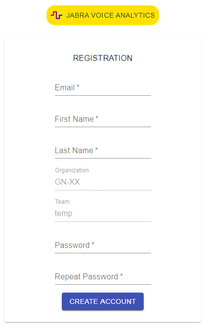

---

 Welcome and congratulations on deciding to use **Jabra SMILE**! These next docs will guide you to learn how to use this tool.
## Installation 

* **Register** your SMILE account by filling out the form found at this 
[link](https://smile-dev.jabra.com/registration?organization=GN-XX&teamName=temp). 

     

 

 

<!--insert image   -->

* **Download** [Jabra SMILE Voice Analytics Client installation package](https://smile-dev.jabra.com/setup/jabra%20smile.msi), run the installation file and follow the instructions on the screen.

 

* **Login** when the installation is successfully completed with the username and password you registered with.

     

 

 

* **Congratulations!** You are now ready to use Jabra Voice Analytics! Go to **[How to use?](doc3.md)** to learn more or continue reading about settings. 

    <iframe src="https://giphy.com/embed/tK7GtpStJQA4YNxodX" width="380" frameBorder="0" class="giphy-embed" allowFullScreen></iframe>

 

 

 

## Audio settings

* **Run Jabra SMILE** and right click on the   in the bottom bar on your device. Click on “Settings”.  

<figure class="Product-tour-of-Jabra-engage.ai">
  <iframe src="../img/setting_video_uden_lyd.mp4" width="360" height="252" frameborder="0" allowfullscreen=""></iframe>
</figure>

 

 

* Choose your prefered **Audio Device** and select microphone and speaker e.g. Jabra Evolve2 85.  

 

* Download and install [**Jabra Direct**](https://jabraxpressonlineprdstor.blob.core.windows.net/jdo/JabraDirectSetup.exe) for control options and to enable e.g. **Microsoft Teams integration** 
<!--

<figure class="Product-tour-of-Jabra-engage.ai">
  <iframe src="../img/choose_headphones_trim.mp4" width="480" height="231" frameborder="0" allowfullscreen=""></iframe>
</figure>

  -->

   * In **Jabra Direct** go to **Device** and manage your audio device(s). Integrate prefered softphone in **Settings**.

<figure class="Product-tour-of-Jabra-engage.ai">
  <iframe src="/img/jabra_direct_Trim.mp4" width="310" height="200" frameborder="0" allowfullscreen=""></iframe>
</figure>

 

 

* **Jabra SMILE is now ready to analyze every call and support you every step of the way - Enjoy!**

